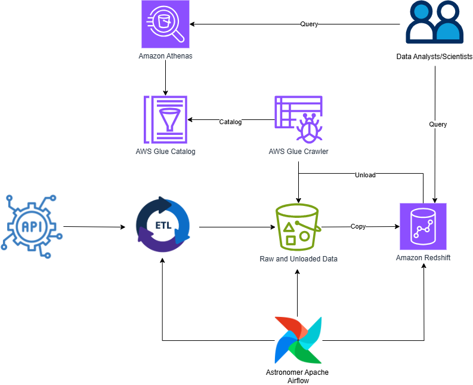

AWS Lakehouse with Apache Airflow
=================================

Project Contents
================

Apache Airflow was implemented using [Astronomer](https://www.astronomer.io/docs/learn/get-started-with-airflow). Astro project contains the following files and folders:

- dags: This folder contains the Python files for Airflow DAGs
- Dockerfile: This file contains a versioned Astro Runtime Docker image.
- include: This folder contains any additional files that you want to include as part of the project. 
- requirements.txt: Install Python packages needed for the project by adding them to this file.
- airflow_settings.yaml: Airflow Connections, Variables, and Pools instead of entering them in the Airflow UI.

Deploy Project Locally
===========================

1. Start Airflow on your local machine by running 'astro dev start'.

This command will spin up 4 Docker containers on your machine, each for a different Airflow component:

- Postgres: Airflow's Metadata Database
- Webserver: The Airflow component responsible for rendering the Airflow UI
- Scheduler: The Airflow component responsible for monitoring and triggering tasks
- Triggerer: The Airflow component responsible for triggering deferred tasks

2. Verify that all 4 Docker containers were created by running 'docker ps'.

Note: Running 'astro dev start' will start your project with the Airflow Webserver exposed at port 8080 and Postgres exposed at port 5432. If you already have either of those ports allocated, you can either [stop your existing Docker containers or change the port](https://www.astronomer.io/docs/astro/cli/troubleshoot-locally#ports-are-not-available-for-my-local-airflow-webserver).

3. Access the Airflow UI for your local Airflow project. To do so, go to http://localhost:8080/ and log in with 'admin' for both your Username and Password.

You should also be able to access your Postgres Database at 'localhost:5432/postgres'.

